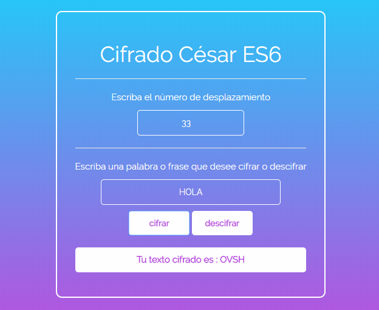

# Cifrado César ES6

* **Track:** _JS Deep Dive_
* **Curso:** _Crea tu propia librería usando Javascript_
* **Unidad:** _reto 1 _

***

El presente reto pone a prueba nuestros conocimientos sobre **ES6**, utilización de sintaxis.

## Objetivo

El reto consiste en reutilizar nuestro código de un reto anterior ** Cifrado César** y convertir su sintaxis de acuerdo al estandar ES6. Este programa se encarga de cifrar y descifrar mensajes del usuario. A continuación una imagen del resultado:

## Detalles adicionales

* Dentro del repositorio encontrarás un archivo index.html el cual contiene la estructura sobre la que se realizó el reto.
* En la carpeta css un archivo main.css donde está todos los estilos aplicados los cuales están enlazados con mi HTML.
* En assets también se encuentra la carpeta images donde se encuentran todos las imágenes usadas para completar este reto.
* Por último el README.md explicando el contenido de mi repositorio.
* Dentro de la rama **gh-pages** un link donde se podrá visualizar el resultado final.

## Autor

* Gabriela Mamani Flores.